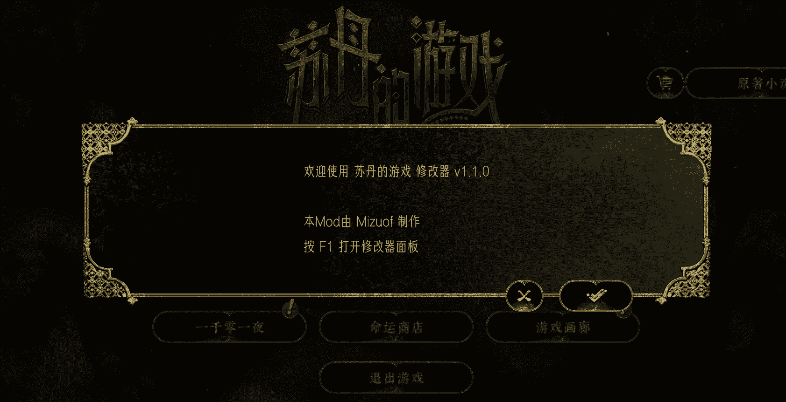
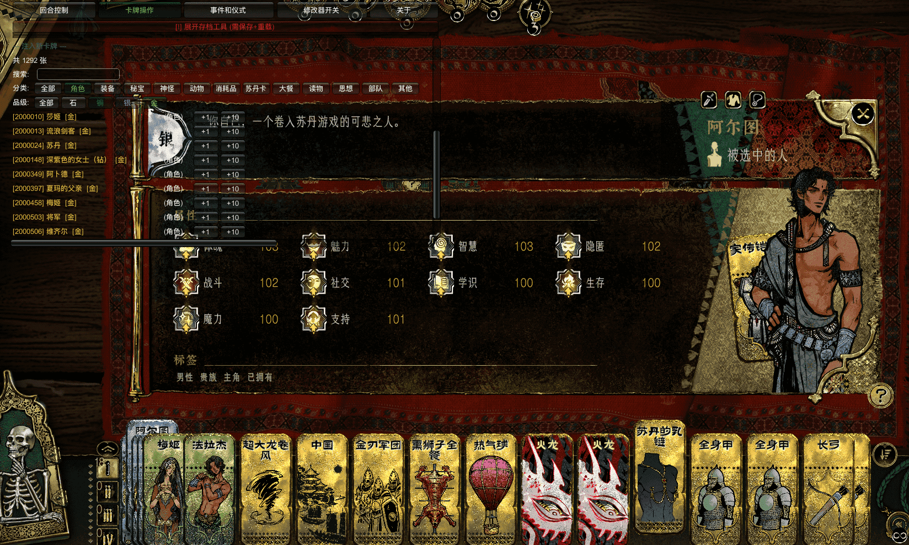

# 苏丹的游戏 修改器

苏丹的游戏 MelonLoader Mod — 游戏内修改面板，按 F1 打开。



## 安装方法

### 1. 安装 MelonLoader

下载 MelonLoader.Installer：

[MelonLoader.Installer.exe 直接下载](https://github.com/LavaGang/MelonLoader.Installer/releases/download/4.3.0/MelonLoader.Installer.exe)

> 或用浏览器打开 [Release 页面](https://github.com/LavaGang/MelonLoader.Installer/releases/tag/4.3.0) 自行选择版本。

打开 MelonLoader.Installer，按以下步骤操作：

1. 在列表中找到 **Sultan's Game**
2. **Install v0.7.2**（越新越好，但看体质；开发环境为 v0.7.2）
3. 安装完成后，**运行一次游戏**，务必进入游戏主界面再退出（首次运行会生成必要文件，速度看网络）
4. 游戏根目录出现 `MelonLoader/` 和 `Mods/` 文件夹即安装成功

> **如果控制台报错或安装失败**：卸载后尝试降低 MelonLoader 版本（例如 v0.7.1）。

### 2. 安装 Mod

将 `SultansGameMod.dll` 放入游戏根目录的 `Mods/` 文件夹。

### 3. 启动

启动游戏，进入主界面后按下 **F1** 打开修改面板。

## Steam 游戏根目录快速定位

Steam 库 → 右键 **Sultan's Game** → 管理 → 浏览本地文件。

## 功能面板

| Tab | 功能 |
|---|---|
| 回合控制 | 回合跳转/冻结、游戏变速、游戏结束、重载存档 |
| 卡牌操作 | 选中卡牌属性编辑、标签编辑、注入新卡牌（搜索/分类筛选） |
| 事件仪式 | 活跃事件管理、事件搜索与触发、仪式搜索与添加 |
| 自定义事件 | 声望/计数器数值选择、卡牌注入、特殊机会（交换苏丹牌/回到上一回合） |
| 关于 | 作者信息与链接 |

## 构建

```bash
dotnet build "SultansGameMod/SultansGameMod.csproj" -c Release -o "输出目录"
```

需要 .NET 6 SDK + MelonLoader v0.7.2 依赖（`MelonLoader/net6/` 和 `MelonLoader/Il2CppAssemblies/`）。

---

**作者**: Mizuof  
**B站**: https://space.bilibili.com/516995192/dynamic  
**QQ群**: 624594852  
**网站**: www.mizu7.top  

*本修改器完全免费，请勿用于商业用途。*
补充:以下是所有结局的 ID 及其对应的 `"name"` 字段：

- 0: 结局标题
- 1: 伴君如伴虎
- 2: 永恒之梦
- 3: 不自量力
- 4: 因果报应
- 5: 欢愉的极致
- 6: 欢愉的极致
- 7: 啊！死了
- 8: 伴君如伴虎
- 9: 温柔乡
- 10: 顺水推舟
- 11: 一时大意
- 12: 期限已至
- 13: 无名人之死
- 14: 多行不义
- 15: WIN！
- 16: 再见了狗苏丹
- 17: 无路可逃
- 18: 明日复明日
- 19: 反戈一击
- 20: 嫌隙丛生
- 21: 屠龙的莽行
- 22: 啊！死了
- 23: 跌落
- 24: 未战而逃
- 25: 复仇之火
- 26: 自身难保
- 27: 星之衰
- 28: 灰飞烟灭
- 29: 欲望之池
- 30: 最后拥抱
- 31: 星之救赎
- 32: 后悔药
- 33: 功败垂成
- 34: 扎根
- 35: 碎镜
- 36: 死于镜中
- 37: 胆挺肥
- 38: 夺舍
- 39: 篡夺之罪
- 40: 自燃（废弃）
- 41: 循环回响
- 42: 黯淡之星
- 43: 死兆星
- 999: （无 name，仅 text 字段）
- 100: 逃往中国
- 101: 逃往遥远的绿洲
- 102: 神的仆人
- 103: 宇宙图书馆
- 200: 谋逆者之血
- 201: 战败者之血
- 202: 长夜将尽
- 203: 罪己
- 204: 新的国
- 205: 无尽夜
- 206: 新日之书
- 207: 新日之坠
- 208: 日之牢笼
- 209: 征服之末
- 210: 游戏之国
- 211: 征服者的牢笼
- 212: 征服者的奖赏
- 213: 站着的苏丹
- 214: 忠诚之刃
- 215: 游戏之国
- 216: 冥府之约
- 217: 血脉的囚笼
- 218: 一国二王
- 219: 金血之末
- 220: 游戏之国
- 221: 金血之囚
- 222: 追忆之国
- 223: 红袍的叛星者
- 224: 星剑的遗言
- 225: 丛林之国
- 226: 星剑之国
- 227: 誓言的囚徒
- 228: 坠星冉升
- 229: 丛林之国
- 230: 伟业之国
- 231: 终点的笑声
- 232: 命运之剪
- 233: 遭窃的果实
- 234: 千廊之国
- 235: 灯影下
- 236: 命运的报偿
- 237: 低垂的果实
- 238: 人之国
- 239: 有罪的石头
- 240: 荒野的呼号
- 241: 流浪欲
- 242: 人之国
- 243: 全城起火
- 244: 不起眼的朋友
- 245: 流浪欲
- 246: 贤者之国
- 247: 终点的笑声
- 248: 命运之剪
- 249: 遭窃的果实
- 250: 均衡之国
- 251: 终点的笑声
- 252: 命运之剪
- 253: 遭窃的果实
- 254: 英雄之国
- 255: 征伐之国
- 256: 伯劳的森林
- 257: 英雄之国
- 258: 征伐之国
- 259: 伯劳的森林
- 260: 英雄之国
- 261: 征伐之国
- 262: 伯劳的森林
- 263: 受国之垢
- 264: 夜空中最亮的星
- 265: 受祝福的双星
- 266: 千年抽丝
- 267: 寂静黎明
- 268: 终极造物
- 269: 热闹的小家
- 270: 完美幻梦
- 271: 完美幻梦
- 272: 寂静的林地
- 273: 君权神授（废弃）
- 274: 昼夜契约（废弃）
- 275: 在真空之中
- 276: 断绝
- 277: 重归纯净
- 278: 安宁
- 279: 梦的神话
- 280: 梦境之王
- 281: 无情轮回
- 282: 无数次·再会
- 283: 梦幻宫殿
- 284: 梦幻宫殿
- 285: 梦幻宫殿
- 286: 纠正一切
- 287: 诸神的面容
- 288: 尽在书中
- 289: 英雄之国（废弃）
- 290: 征伐之国（废弃）
- 291: 伯劳的森林（废弃）
- 292: 英雄之国
- 293: 征伐之国
- 294: 伯劳的森林
- 301: 神圣的牺牲
- 302: 幸福
- 303: 孤星
- 401: 无数次
- 402: 收集者
- 403: 交媾罗网
- 404: 金色荒芜
- 405: 凯旋尸骸
- 406: 自戕之锋
- 501: 寂静之歌
- 502: 弑神者
- 601: 愿望之神
- 602: 截稿日
- 603: 腐化
- 604: 无尽的旅途
